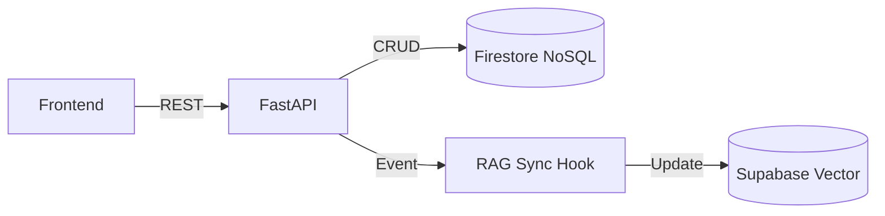

# Products Service - UCB Commerce

The central source of truth for the UCB Commerce catalog, managing product lifecycle, inventory, and categorization.

## The Problem
Managing a diverse catalog across multiple university careers requires a flexible schema. Traditional relational databases often struggle with the varying attributes of different product types (e.g., "Textbooks" vs. "Lab Equipment"). We needed a system that could handle this variability while maintaining strict consistency for inventory.

## Architecture


## Technical Decisions

### Why Python & FastAPI?
- **Speed**: FastAPI is one of the fastest Python frameworks, essential for high-traffic catalog browsing.
- **Type Safety**: Pydantic models ensure that even with a NoSQL database, our application logic relies on strictly typed data structures, preventing runtime errors.

### Why Google Firestore (NoSQL)?
We chose **Firestore** over a SQL database for the catalog because of its **flexible schema**. Products in an e-commerce setting often have different attributes. Firestore allows us to store these heterogeneous documents efficiently without complex join tables. Additionally, its real-time capabilities allow for future features like live stock updates.

### RAG Synchronization
To support the Chatbot Service, this service implements an **Event-Driven** pattern. Whenever a product is created or updated, a hook triggers a synchronization process that updates the vector embeddings in Supabase. This ensures the AI assistant always has the latest product data without needing a full re-index.

## Features
- **CRUD Operations**: Complete management of products.
- **Category & Career Filtering**: Hierarchical organization.
- **Inventory Management**: Basic stock tracking.
- **RAG Sync**: Automatic vector embedding updates.

## Tech Stack
- **Language**: Python 3.10+
- **Framework**: FastAPI
- **Database**: Google Firestore

## Setup & Run

1.  **Install dependencies:**
    ```bash
    pip install -r requirements.txt
    ```

2.  **Configure Environment Variables:**
    Set up `.env` with Firebase credentials and Supabase keys (for RAG sync).

3.  **Run Server:**
    ```bash
    uvicorn app.main:app --reload --port 8003
    ```